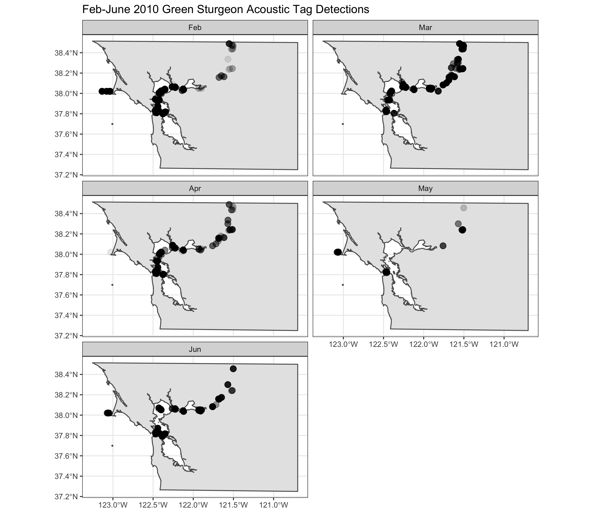

# Green Sturgeon Acoustic Tag Detections
This repository contains R scripts for reading and processing green sturgeon acoustic tag detection data. Code files are located in the `./R` directory. The raw data file (~4GB) is not uploaded to this repository. However the code expects to find that raw data file on your local machine, and to be stored in the `./data` directory. All R scripts were developed to be sourced from this parent directory, i.e. from the directory where this README file is located. So, if you are using RStudio, save your `*.Rproj` file to this parent directory (or otherwise point your R working directory here before running the scripts). The `./R/read_data.R` script pre-processes the raw data by reading it in chunks, selecting relevant columns (to reduce chunk file size), and writing each chunk as an individual `*.csv` file to disk. The `./R/query_spring_2010.R` script provides an example, using parallel processing, to query the data and return Feb-Jun 2010 acoustic tag detections. That script also writes the returned data for 2010 to disk and maps those tag detections for data verification at this stage.

